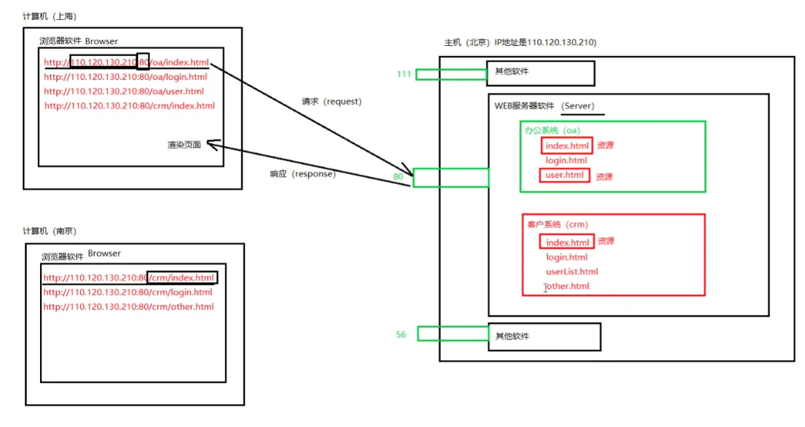
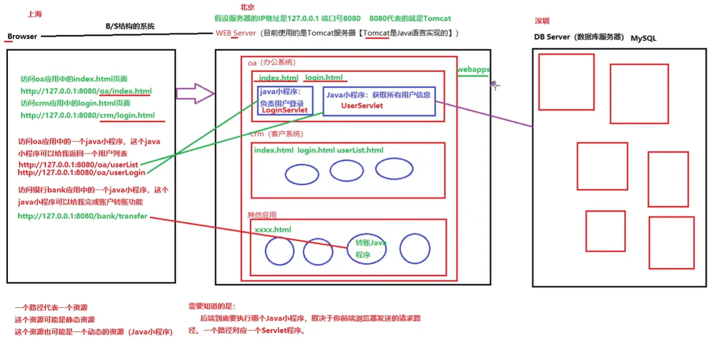

## 1.系统架构介绍

B/S架构和C/S架构是两种常见的软件系统架构，相信作为在网络游戏中身经百战你，也听说过网页游戏（如4399），这样的游戏不需要下载，可以直接在网页上玩，而像穿越火线这种网络游戏却要下载之后才能玩，甚至游戏本身还很大。这两种玩游戏的方式，正好对应了两种不同的系统架构：**Browser/Server架构、Client/Server架构**，没想到吧，儿时的你就以及领略过不同架构开发的软件系统。

### 1.1 C/S架构

Client/Server 架构，见名知意，这种架构中两个重要角色是：Client(客户端)、Server(服务器)。这里的客户端其实就对应那些需要下载的游戏，这些游戏往往比较大型，游戏中的人物角色制作比较精美，如果把这些游戏做成页游，服务器需要负责存储所有的信息，那么服务器要把人物模型响应给浏览器，然后浏览器再把人物给渲染出来，由于要传递的东西非常大，这个过程会很慢，游戏的体验就会变差。所以需要用户在玩游戏前，事先在本地下载一个客户端，在这个客户端中可能会存储角色的模型，角色的动作等等，这样就**帮服务器分担了压力**，可以给到用户更好的游戏体验。

结合上述可以知道 

**C/S 架构特点**：

+ **需要用户去安装特定的客户端软件**
+ **客户端本身带有数据，不需要全部的数据都从服务器端传过来**

**C/S 架构优点：**

+ **速度快，软件中的大部分数据存储再客户端中，只有很小一部分数据需要从服务器端传过来**
+ **服务器压力小**

**B/S 架构缺点：**

+ **升级维护成本高**

### 1.2 B/S 架构

Browser/Server架构其实可以说是一个特殊的 C/S架构，只不过Client变成了浏览器。对应上面说的页游，可以很快知道 B/S 架构和 C/S 架构的区别和特点

**B/S架构优点：**

+ **无需用户安装特定的客户端软件**
+ **升级维护方便，成本比较低**

**B/S架构缺点：**

+ **速度慢**
+ **服务器压力大**
+ **所有的数据都在服务器上，不安全**

## 2.B/S 架构系统的通信方式

在浏览器上键入要访问的网址域名，点击访问就能够得到我们想要的页面。在这个过程中，域名解析器会将域名解析出来一个具体的IP地址和端口号（IP地址是主机在网络种的唯一标识，端口号是进程在主机种的唯一标识），随后服务器收到来自浏览器的请求，服务器对应的进程把浏览器请求的前端代码响应并输出到浏览器上。接着浏览器进行渲染，执行html、css、JavaScript代码，展示效果。整个通信过程如下图所示。

注意：Web服务器指的不是整个服务器主机，而是运行在服务器主机上的Web服务器软件，对应着一个进程，一个端口号。

请求：从browser端发送数据到server端的过程称为请求，request

响应：从server端发送数据到browser端的过程称为响应，response

## 3.B/S 架构系统的角色和协议

B/S架构系统的角色：浏览器，服务器，数据库

浏览器通过向服务器发送请求获取想要访问的页面，对于静态资源服务器可以直接响应输出对应的前端代码，而对于动态页面，例如在学生信息管理系统中查询全部学生的成绩时，服务器需要从数据库中查询到对应的结果，在响应给前端。在整个过程中，前端与服务器交互需要遵守HTTP协议，服务器与数据库交互需要遵守JDBC规范。数据传递的流程如下图所示。

在浏览器上通过程序的路径来标识服务器中的程序，一个路径代表一个资源，这个资源可能是静态资源，也可能是动态资源，后台要运行哪个Java程序，取决于前端浏览器发送的请求路径，一个路径对应一个Servlet程序。

