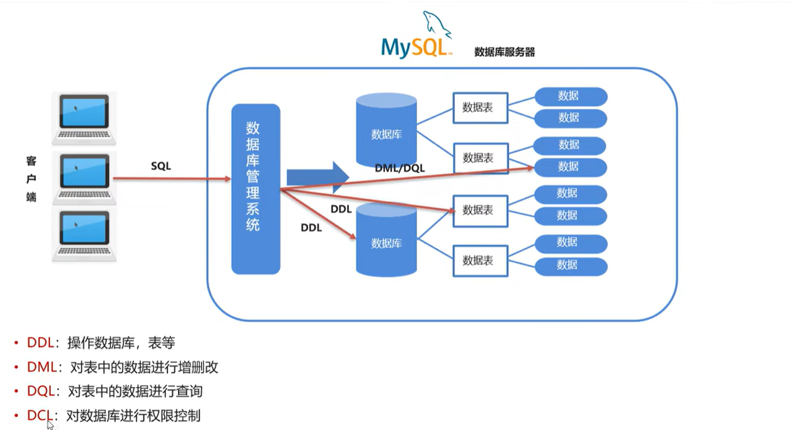
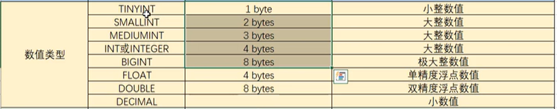
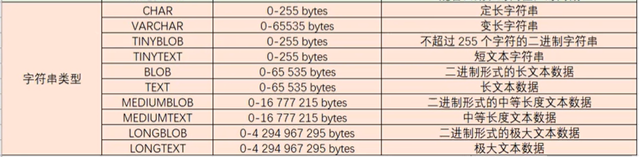
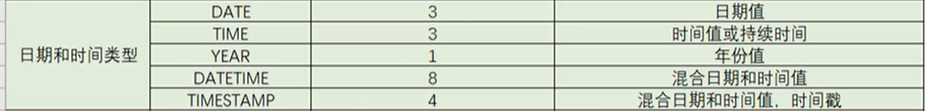

# MySQL

JavaWeb是用Java技术栈进行Web应用开发，Web应用中会包含用户和平台的各种数据，要存储这些数据就要用到数据库，数据库需要数据库管理系统来管理，MySQL是一个热门的关系型数据库管理系统。

## SQL

我们在开发过程中接触到比较多的应该是SQL语句，尤其是查询语句。SQL（Structured Query Language 简称 SQL），结构化查询语言，一门操作关系型数据库的编程语言。

SQL通用语法：SQL语句可以单行或多行书写，以分号结尾。MySQL数据库的SQL语句不区分大小写，关键字建议大写。

注释：

```mysql
-- 单行注释  
# 单行注释

/* 多行注释
   多行注释	*/
```

SQL语句分为四类：DDL、DML、DQL、DCL



- **DDL**：数据定义语言，用来定义数据库对象：数据库、表等
- **DML**：数据操作语言，用来对数据库中表的数据进行增删改
- **DQL**：数据查询语言，用来查询数据库中表的记录
- **DCL**：数据控制语言，用来定义数据库的访问权限和安全级别，和创建用户

## DDL

操作数据库：

- 查询

  ```mysql
  show database;
  ```

- 创建

  ```mysql
  create database 数据库名称;
  
  -- 创建时加入判断
  create database if not exists 数据库名称;
  ```

- 删除

  ```mysql
  drop database 数据库名称;
  
  -- 删除是加入判断
  drop database if exists 数据库名称;
  ```

- 使用数据库

  ```mysql
  -- 查看当前使用的数据库
  select database();
  
  -- 使用数据库
  use 数据库名称;
  ```

操作表：

- 查询表：

  ```mysql
  -- 查询当前数据库下所有表
  show tables;
  
  -- 查询表结构
  desc 表名;
  ```

- 创建表

  ```mysql
  create table 表名 (
  	字段1名称 字段1类型，
      字段2名称 字段2类型，
      ...      ...,
      字段n名称 字段n类型
  );
  ```

  MySQL的数据类型：

  - 数值类型：
    

  - 字符串类型：

    

  - 日期和时间类型：

    

- 删除表
  
  ```mysql
  drop table 表名;
  
  -- 加上判断
  drop table if exists 表名;
  ```

- 修改表

  ```mysql
  -- 修改表名
  alter table 表名 rename to 新表名;
  
  -- 添加一列
  alter table 表名 add 列名 数据类型;
  
  -- 修改数据类型
  alter table 表名 modify 列名 新数据类型;
  
  -- 修改列名和数据类型
  alter table 表名 change 列名 新列名 新数据类型;
  
  -- 删除列
  alter table 表名 drop 列名;
  ```

  

## DML

- 添加数据

  ```mysql
  -- 给指定的列添加数据
  insert into 表名(列1, 列2, ...) values (值1, 值2, ...);
  
  -- 给所有列添加数据
  insert into 表名 values (值1, 值2, ...);
  
  -- 批量添加数据
  insert into 表名(列1, 列2, ...) values (值1, 值2, ...), (值1, 值2, ...),
  (值1, 值2, ...),(值1, 值2, ...),(值1, 值2, ...) ...;
  
  insert into 表名 values (值1, 值2, ...), (值1, 值2, ...),
  (值1, 值2, ...),(值1, 值2, ...),(值1, 值2, ...) ...;
  ```

- 修改数据

  ```mysql
  update 表名 set 列1 = 值1, 列2 = 值2, ... [where 条件];
  -- 注意: 修改语句中如果不加条件，则表中所有记录都会被修改
  ```

- 删除数据

  ```mysql
  delete from 表名 [where 条件]
  -- 注意: 如果删除语句中不加条件，则表中所有记录都会被删除
  ```


## DQL

- 基础查询

  ```mysql
  select * from 表名; -- 查询所有数据
  select 字段列表 from 表名; -- 查询多个字段
  
  select distinct 字段列表 from 表名; -- 去除重复记录
  
  select 字段1 as z1, 字段2 z2 from 表名; -- as起别名，也可以省略
  ```

  


