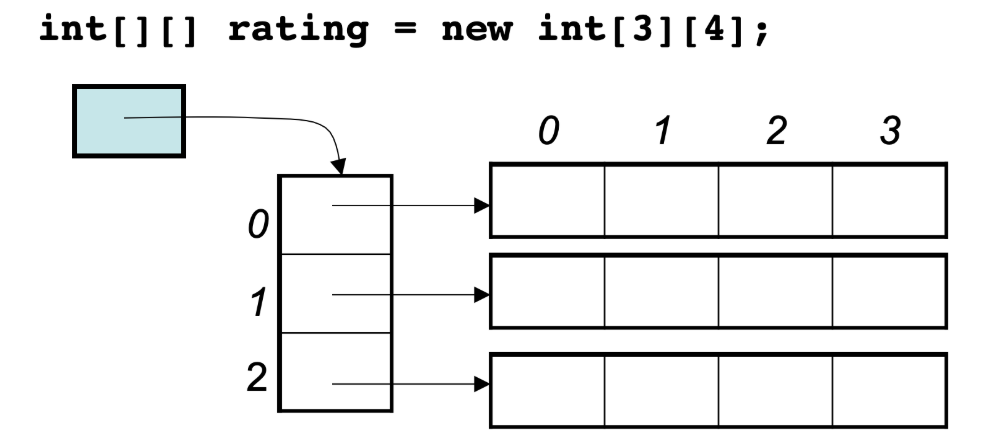

## 1.数组理论基础

数组定义：**数组是存放在连续内存空间上的相同数据类型的集合。**

在Java中数组可以被拆分成两个部分，一个是引用变量（数组名），一个是数组的元素数据。

### 一维数组

在Java中通过下面的语句初始化数组

```java
int[] arr = new int[n];
```

在上面这段语句中，new 操作从**堆空间**中申请了 n 个 int 所需要的连续空间，并且让引用变量 arr 指向这段堆空间（arr存储了这段堆空间的首地址）。arr 引用本身则存储在栈空间中。

所以当你将 arr 数组直接赋值给另一个数组时，如：

```java
int[] otherArr = arr
```

 仅仅是让引用变量 otherArr 指向 arr 所指向的堆空间，过程中并没有产生新的数组。所以在后面如果修改了otherArr 的值，arr 也会跟着一起变动

### 二维数组

二维数组可以视作 "数组的数组"，即**一维数组的元素是一维数组**。

二维数组的初始化语句为

```java
int[][] arr2 = new int[n][m];
```

此时arr2作为数组的引用变量存储在栈内存中，而其中的一维数组元素 arr2[i] 则存储在栈内存中，同时 arr2[i] 也作为引用变量存储着第 i 行数组的数据，而这一部分实际的数据也存储在堆内存中。存储结构如下图：



## 2.二分查找

在一个有序数组上的二分查找可以分为4中情况：

- 寻找**大于等于** $x$ 的第一个数
- 寻找**大于** $x$ 的第一个数        （用大于等于实现: $\ge (x + 1)$ )
- 寻找**大于等于** $x$ 的最后一个数	 （用大于等于实现: $(\ge (x + 1)) - 1$ )
- 寻找**小于** $x$ 的最后一个数	 （用大于等于实现: $(\ge x) - 1$ )

在我看来，二分查找其实就是两种情况，查找符合要求的最左边的数，和查找符合要求的最右边的数

### 题目

#### 704. 二分查找

```java
class Solution {
    public int search(int[] nums, int target) {
        int left = 0, right = nums.length;

        while(left < right) {
            int mid = left + (right - left) / 2;
            if(nums[mid] >= target) right = mid;
            else left = mid + 1;
        }

        if(left == nums.length) return -1;
        
        return nums[left] == target ? left : -1;
    }
}
```

#### [35. 搜索插入位置](https://leetcode.cn/problems/search-insert-position/)

左闭右开区间，查找大于等于 $target$ 的最左边的位置

```java
class Solution {
    public int searchInsert(int[] nums, int target) {
        int l = 0, r = nums.length;
        while(l < r) {
            int mid = l + (r - l) / 2;
            if(nums[mid] >= target) r = mid;
            else l = mid + 1;
        }
        return l;
    }
}
```

#### [34. 在排序数组中查找元素的第一个和最后一个位置](https://leetcode.cn/problems/find-first-and-last-position-of-element-in-sorted-array/)

查找 $target$ 的第一个位置可以用 **左闭右开** 区间，而查找最后一个位置可以转化为查找 $target + 1$ 的第一个位置再减去 $1$ 。

```java
class Solution {
    
    int lower_bound(int[] nums, int target) {
        int l = 0, r = nums.length;
        while(l < r) {
            int mid = l + (r - l) / 2;
            if(nums[mid] >= target) r = mid;
            else l = mid + 1;
        }
        return l;
    }

    public int[] searchRange(int[] nums, int target) {
        int leftIndex = lower_bound(nums, target);
        if(leftIndex == nums.length || nums[leftIndex] != target) {
            return new int[]{-1, -1};
        }
        int rightIndex = lower_bound(nums, target + 1) - 1;
        return new int[]{leftIndex, rightIndex};
    }
}
```

#### [69. x 的平方根](https://leetcode.cn/problems/sqrtx/)

因为要求查找出来的平方根是算数平方根向下取整，所以情况分为以下两种

- 如果 $x$ 是完全平方数的话，那么二分查找到的中点 $mid$ 满足$mid * mid = x$
- 如果 $x$ 不是完全平方数的话，那么有 $mid * mid < x$

所以可以知道对于真正的实数平方根 $\sqrt{x}$，我们要查找的是的 $\le \sqrt{x}$ 最大的整数

```java
class Solution {
    public int mySqrt(int x) {
        long l = 0, r = x;
        while(l < r) {
            long mid = (l + r + 1) / 2;
            if(mid * mid <= x) l = mid;
            else r = mid - 1; 
        }
        return (int)l;
    }
}
```

#### [367. 有效的完全平方数](https://leetcode.cn/problems/valid-perfect-square/)

和上一题一样，查找 $x$ 的整数平方根 $l$ ，检查是否满足 $l * l = x$

```java
class Solution {
    public boolean isPerfectSquare(int num) {
        long l = 0, r = num;
        while(l < r) {
            long mid = (l + r + 1) / 2;
            if(mid * mid <= num) l = mid;
            else r = mid - 1;
        }
        return l * l == num;
    }
}
```


## 3.移除元素

#### [27. 移除元素](https://leetcode.cn/problems/remove-element/)

使用双指针，一个指针 $k$ 指向数组值不为 $val$ 的序列的尾部，一个指针 $i$ 指向原数组并一直向后移动。当指针 $i$ 指向的元素数值不为 $val$ 的时候，将指针 $k$ 指向的位置值置为 $nums[i]$，然后指针 $k$ 向后移动。

```java
class Solution {
    public int removeElement(int[] nums, int val) {
        int k = 0;
        for(int i = 0; i < nums.length; i ++) {
            if(nums[i] != val) {
                nums[k ++] = nums[i];
            }
        }
        return k;
    }
}
```

#### [26. 删除有序数组中的重复项](https://leetcode.cn/problems/remove-duplicates-from-sorted-array/)

双指针，一个指针 $i$ 指向原数组，指针 $j$ 每次都指向 $i$ ，然后向后移动，当两个指针指向的元素数值不相同的时候，指针 $j$ 停止移动，然后记录指针 $i$ 所指向的元素。最后 $i = j - 1$ 跳过重复的元素

```java
class Solution {
    public int removeDuplicates(int[] nums) {
        int curLength = 0;

        for(int i = 0; i < nums.length; i ++) {
            int j = i;
            while(j < nums.length && nums[j] == nums[i]) j ++;

            nums[curLength ++] = nums[i];

            i = j - 1;
        }

        return curLength;
    }
}
```

#### [283. 移动零](https://leetcode.cn/problems/move-zeroes/)

双指针，把不是0的数插到前面去，然后再把后面的数置成0

```java
class Solution {
    public void moveZeroes(int[] nums) {
        int notZeroCnt = 0;

        for(int i = 0; i < nums.length; i ++) {
            if(nums[i] != 0) {
                nums[notZeroCnt ++] = nums[i];
            }
        }

        for(int i = notZeroCnt; i < nums.length; i ++) {
            nums[i] = 0;
        }
    }
}
```

#### [844. 比较含退格的字符串](https://leetcode.cn/problems/backspace-string-compare/)

 把字符串删除后的结果加入到一个字符串数组中，比较两个结果字符串是否相等。

时间复杂度: $O(n)$ 

空间复杂度: $O(n)$ 

```java
class Solution {
    public boolean backspaceCompare(String s, String t) {
        int indexS = -1, indexT = -1;

        char[] charS = new char[s.length()];
        char[] charT = new char[t.length()];

        for(char c : s.toCharArray()) {
            if(c == '#' && indexS != -1) {
                indexS --;
            } else if(c != '#'){
                charS[++ indexS] = c;
            }
        }

        for(char c : t.toCharArray()) {
            if(c == '#' && indexT != -1) {
                indexT --;
            } else if(c != '#'){
                charT[++ indexT] = c;
            }
        }
        
        if(indexS != indexT) return false;

        for(int i = 0; i <= indexS; i ++) {
            if(charS[i] != charT[i]) {
                return false;
            }
        }
        return true;
    }
}
```

要实现题目要求的 $O(n)$ 时间复杂度和 $O(1)$ 空间复杂度，可以从后面向前面找，每次找到符合要求的字符

```java
class Solution {
    public boolean backspaceCompare(String s, String t) {
        int i = s.length() - 1, j = t.length() - 1;

        while(i >= 0 || j >= 0) {
            i = getIndex(s, i);
            j = getIndex(t, j);
        
            char charS = i >= 0 ? s.charAt(i) : '0';
            char charT = j >= 0 ? t.charAt(j) : '0';

            if(charS != charT) {
                return false;
            }
            
            i --;
            j --;
        }

        return true;
    }

    public int getIndex(String str, int idx) {
        int cnt = 0;
        while((idx >= 0 && str.charAt(idx) == '#') || cnt > 0) {
            if(idx >= 0 && str.charAt(idx) == '#') {
                cnt ++;
            } else {
                cnt --;
            }
            idx --;
        } 
        return idx;
    }
}
```

#### [977. 有序数组的平方](https://leetcode.cn/problems/squares-of-a-sorted-array/)

用两个数组，一个存升序的正数，一个存降序的负数，然后两个数组每个元素平方后，就都变成了升序，最后合并两个升序数组。

```java
class Solution {
    public int[] sortedSquares(int[] nums) {
        int[] posNum = new int[nums.length];
        int[] negNum = new int[nums.length];

        int cntPos = 0, cntNeg = 0;

        int idx = 0;
        while(idx < nums.length && nums[idx] < 0) {
            idx ++;
        }

        
        for(int i = idx; i < nums.length; i ++) {
            posNum[cntPos ++] = nums[i];
        }
        for(int i = idx - 1; i >= 0; i --) {
            negNum[cntNeg ++] = nums[i];
        }

        int[] ans = new int[nums.length];

        int i = 0, j = 0, cnt = 0;
        while(i < cntPos && j < cntNeg) {
            int a = posNum[i] * posNum[i];
            int b = negNum[j] * negNum[j];
            if(a <= b) {
                ans[cnt ++] = a;
                i ++;
            } else {
                ans[cnt ++] = b;
                j ++;
            }
        }

        while(i < cntPos) {
            ans[cnt ++] = posNum[i] * posNum[i];
            i ++;
        }
        
        while(j < cntNeg) {
            ans[cnt ++] = negNum[j] * negNum[j];
            j ++;
        }

        return ans;
    }
}
```

## 4.长度最小的子数组

#### [209. 长度最小的子数组](https://leetcode.cn/problems/minimum-size-subarray-sum/)

变长滑动窗口，当滑动窗口内的和小于 $target$ 的话，就把窗口向后继续扩张，如果窗口内的值以及满足要求的话，则窗口左边界向右移动

```java
class Solution {
    public int minSubArrayLen(int target, int[] nums) {
        int sum = 0;

        int ans = Integer.MAX_VALUE;
        for(int i = 0, j = 0; i < nums.length; i ++) {
            sum += nums[i];

            if(sum < target) {
                continue;
            }

            while(sum >= target) {
                ans = Math.min(ans, i - j + 1);
                sum -= nums[j ++];
            }
        }

        return ans == Integer.MAX_VALUE ? 0 : ans;
    }
}
```

#### [904. 水果成篮](https://leetcode.cn/problems/fruit-into-baskets/)

变长滑动窗口，维护一个滑动窗口，窗口中只包含两个种类的水果

```java
import java.util.*;

class Solution {
    public int totalFruit(int[] fruits) {
        int kind = 0;        
        
        int mx = 0;
        for(int x : fruits) mx = Math.max(mx, x);

        int[] cnt = new int[mx + 1];
        int ans = 0;

        for(int i = 0, j = 0; i < fruits.length; i ++) {
            
            if(cnt[fruits[i]] == 0) {
                kind ++;
            }

            cnt[fruits[i]] ++;

            while(kind > 2) {
                cnt[fruits[j]] --;
                if(cnt[fruits[j]] <= 0) {
                    kind --;
                }
                j ++;
            }
            
            ans = Math.max(ans, i - j + 1);
        }

        return ans;
    }
}
```

#### [59. 螺旋矩阵 II](https://leetcode.cn/problems/spiral-matrix-ii/)

```java
class Solution {
    public int[][] generateMatrix(int n) {
        int[][] ans = new int[n][n];

        int k = 1;
        
        int i = 0, j = -1;
        while(k <= n * n) {
            while(j + 1 < n && ans[i][j + 1] == 0) ans[i][++ j] = k ++;
            while(i + 1 < n && ans[i + 1][j] == 0) ans[++ i][j] = k ++;
            while(j - 1 >= 0 && ans[i][j - 1] == 0) ans[i][-- j] = k ++;
            while(i - 1 >= 0 && ans[i - 1][j] == 0) ans[-- i][j] = k ++;
        }

        return ans;
    }
}
```

#### [54. 螺旋矩阵](https://leetcode.cn/problems/spiral-matrix/)

```java
class Solution {
    public List<Integer> spiralOrder(int[][] matrix) {
        List<Integer> ans = new ArrayList<>();
        
        int n = matrix.length, m = matrix[0].length;

        boolean[][] vis = new boolean[n][m];

        int cnt = 1;
        int i = 0, j = -1;
        while(cnt <= n * m) {
            while(j + 1 < m && !vis[i][j + 1]) {
                vis[i][j + 1] = true;
                ans.add(matrix[i][++ j]);
                cnt ++;
            }

            while(i + 1 < n && !vis[i + 1][j]) {
                vis[i + 1][j] = true;
                ans.add(matrix[++ i][j]);
                cnt ++;
            }

            while(j - 1 >= 0 && !vis[i][j - 1]) {
                vis[i][j - 1] = true;
                ans.add(matrix[i][-- j]);
                cnt ++;
            }

            while(i - 1 >= 0 && !vis[i - 1][j]) {
                vis[i - 1][j] = true;
                ans.add(matrix[-- i][j]);
                cnt ++;
            }
        }

        return ans;
    }
}
```

#### [LCR 146. 螺旋遍历二维数组](https://leetcode.cn/problems/shun-shi-zhen-da-yin-ju-zhen-lcof/)

```java
class Solution {
    public int[] spiralArray(int[][] array) {
        if(array.length == 0) return new int[]{};

        int n = array.length, m = array[0].length;
        boolean[][] vis = new boolean[n][m];    
        int[] ans = new int[n * m];

        int cnt = 0;
        int i = 0, j = -1;
        while(cnt < n * m) {
            while(j + 1 < m && !vis[i][j + 1]) {
                vis[i][j + 1] = true;
                ans[cnt ++] = array[i][++ j];
            }

            while(i + 1 < n && !vis[i + 1][j]) {
                vis[i + 1][j] = true;
                ans[cnt ++] = array[++ i][j];
            }

            while(j - 1 >= 0 && !vis[i][j - 1]) {
                vis[i][j - 1] = true;
                ans[cnt ++] = array[i][-- j];
            }

            while(i - 1 >= 0 && !vis[i - 1][j]) {
                vis[i - 1][j] = true;
                ans[cnt ++] = array[-- i][j];
            }
        }

        return ans;
    }
}
```

## 5.区间和

#### [58.区间和](https://kamacoder.com/problempage.php?pid=1070)

```java
import java.util.*;
import java.io.*;
public class Main {
    public static void main(String[] args) throws IOException {
        BufferedReader br = new BufferedReader(new InputStreamReader(System.in));
        BufferedWriter bw = new BufferedWriter(new OutputStreamWriter(System.out));
 
        int n = Integer.parseInt(br.readLine());
        int[] arr = new int[n];
 
        for(int i = 0; i < n; i ++) {
            arr[i] = Integer.parseInt(br.readLine());
        }
 
        int[] sum = new int[n + 1];
 
        for(int i = 0; i < n; i ++) {
            sum[i + 1] = sum[i] + arr[i];
        }
 
        String line;
        while((line = br.readLine()) != null) {
            int l = Integer.parseInt(line.split(" ")[0]);
            int r = Integer.parseInt(line.split(" ")[1]);
            System.out.println(sum[r + 1] - sum[l]);
        }
         
    }
}
```

#### [44.开发商购买土地](https://kamacoder.com/problempage.php?pid=1044)

```java
import java.io.*;

public class Main {
    public static void main(String[] args) throws IOException {
        BufferedReader br = new BufferedReader(new InputStreamReader(System.in));
        BufferedWriter bw = new BufferedWriter(new OutputStreamWriter(System.out));

        String nm  = br.readLine();

        int n = Integer.parseInt(nm.split(" ")[0]);
        int m = Integer.parseInt(nm.split(" ")[1]);

        int[][] nums = new int[n][m];

        for(int i = 0; i < n; i ++) {
            String line = br.readLine();
            String[] splitLine = line.split(" ");
            for(int j = 0; j < m; j ++) {
                nums[i][j] = Integer.parseInt(splitLine[j]);
            }
        }

        int[][] sum = new int[n + 1][m + 1];

        for(int i = 0; i < n; i ++) {
            for(int j = 0; j < m; j ++) {
                sum[i + 1][j + 1] = sum[i][j + 1] + sum[i + 1][j] - sum[i][j] + nums[i][j];
            }
        }

        int ans = Integer.MAX_VALUE;

        for(int i = 1; i <= n; i ++) {
            int a = sum[i][m];
            ans = Math.min(ans, Math.abs(sum[n][m] - 2 * a));
        }

        for(int j = 1; j <= m; j ++) {
            int a = sum[n][j];
            ans = Math.min(ans, Math.abs(sum[n][m] - 2 * a));
        }

        bw.write(ans+"");
        bw.flush();
        
        br.close();
        bw.close();
    }
}
```